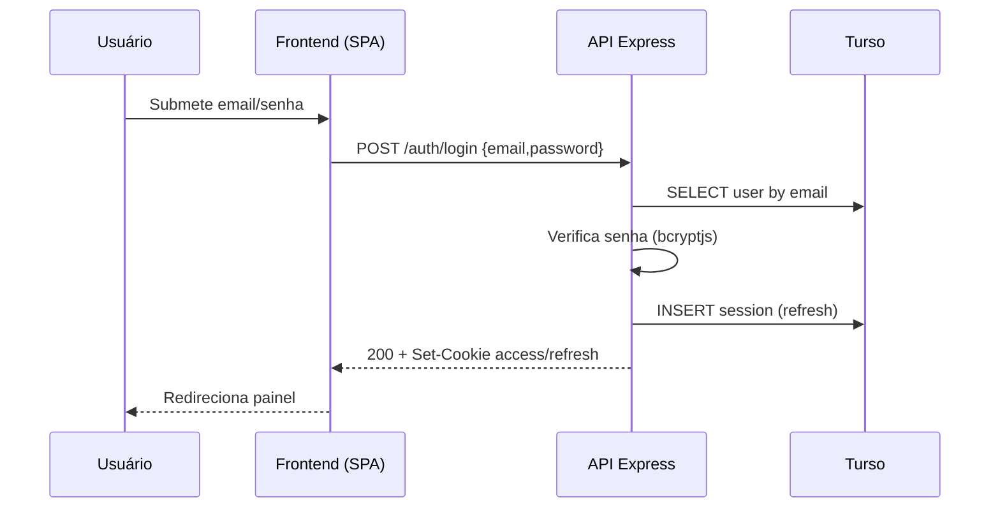
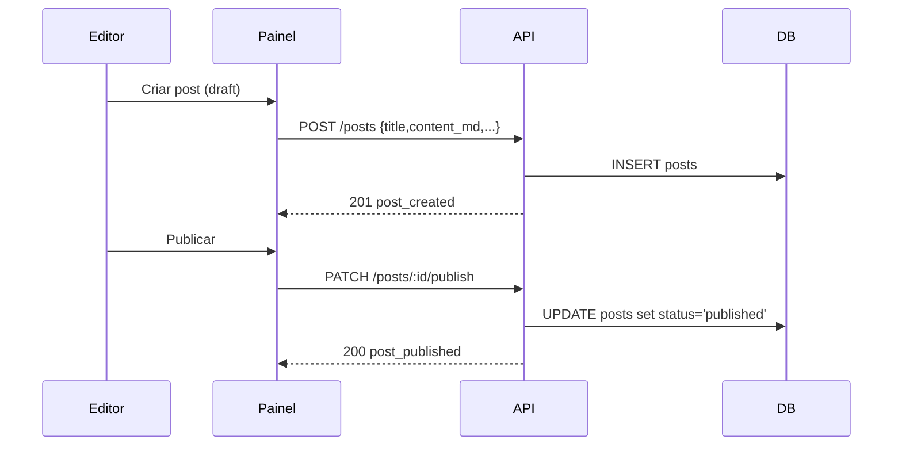
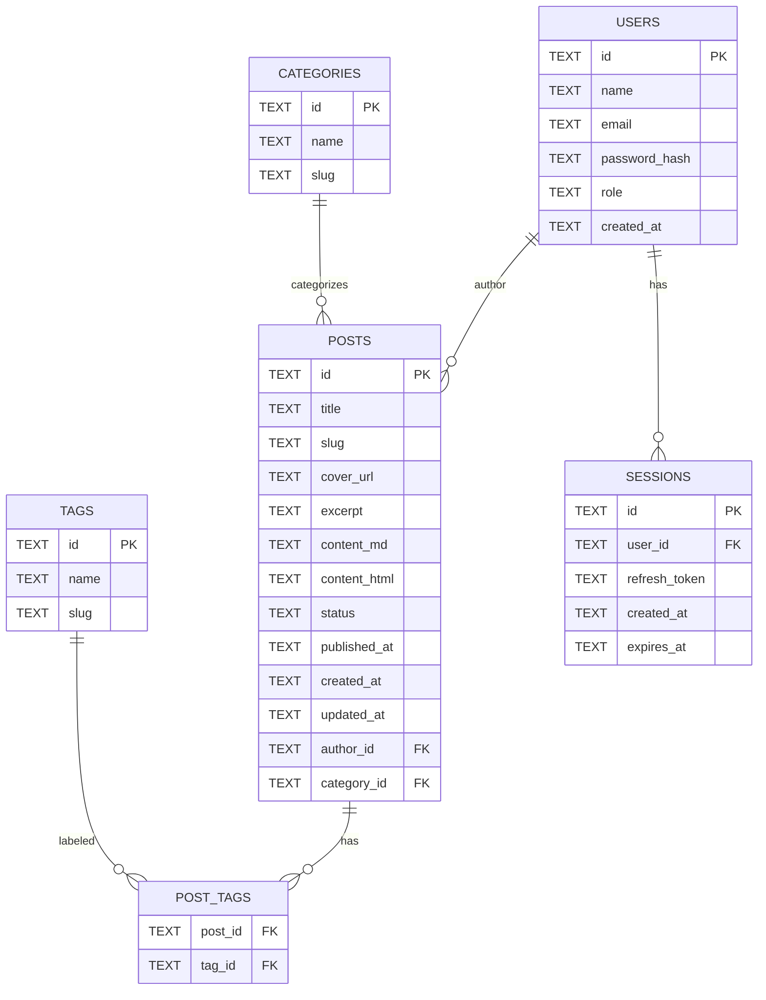

# EasyData360 — Landing Page e Blog (PT‑BR)

Landing page moderna e SPA com blog integrado, painel de gestão e backend conectado ao Turso (libSQL).

## Sumário Executivo

- Escopo: site institucional (landing) com blog público e painel para gestão de conteúdos (posts e categorias), incluindo publicação e agendamento.
- Público‑alvo: leads e clientes EasyData360; equipe interna (marketing/conteúdo) via painel.
- Objetivos do site:
  - Geração de demanda e posicionamento institucional.
  - Divulgação de soluções, serviços e cases.
  - Publicação de artigos (SEO) com fluxo simples de criação/edição/publicação.

## Recursos

- UI moderna e responsiva (Tailwind) com navegação SPA (React + TypeScript).
- Blog público com lista, busca, categorias e página de detalhe.
- Painel de gestão do blog (login) para criar, editar, publicar e agendar posts.
- Preview Markdown → HTML em tempo real no painel (criação e edição).
- Backend Express com autenticação via JWT, banco Turso (libSQL) e rotas REST.

## Stack Técnica

- Frontend: React 19, TypeScript, Vite 6, Tailwind via CDN.
- Backend: Node/Express, JWT, cookie HTTP‑only, bcryptjs, zod.
- Banco: Turso (libSQL) via `@libsql/client`.

## Arquitetura

```mermaid
flowchart LR
  A[Browser] -->|HTTP(S)| B[Frontend SPA (Vite/React)]
  B -->|Fetch JSON| C[API Express (/api)]
  C -->|libSQL| D[(Turso DB)]
  C -->|JWT + Cookies| E[Auth (JWT, Sessions)]
```

- Frontend: SPA React com roteamento por `window.location`, chamadas REST ao backend e cookies HTTP‑only para sessões.
- Backend: Express exportado como handler (compatível com Vercel), CORS com lista de origens, autenticação JWT + tabela de sessões.
- Banco: Turso/libSQL com tabelas `users`, `posts`, `categories`, `tags`, `post_tags`, `sessions`.

Diagrama de sequência (login):


Diagrama de sequência (criar + publicar post):


## Estrutura do Projeto

```
/
├─ api/                         # Backend (Express)
│  ├─ index.js                  # App Express (exportado p/ serverless)
│  ├─ server.js                 # Listener local (porta 3001)
│  ├─ db.js                     # Cliente Turso/libSQL e migrations
│  ├─ routes/
│  │  ├─ auth.js                # Login, refresh, logout, me
│  │  ├─ posts.js               # Listar, criar, atualizar, publicar, agendar, deletar
│  │  └─ categories.js          # CRUD de categorias
│  ├─ middlewares/
│  │  └─ auth.js                # requireAuth / optionalAuth
│  ├─ .env                      # Variáveis do backend (Turso, JWT, CORS)
│  └─ package.json              # Scripts do backend
├─ pages/                       # Páginas da SPA
│  ├─ BlogListPage.tsx          # Lista posts do backend
│  ├─ BlogDetailPage.tsx        # Carrega post por slug do backend
│  └─ BlogManagementPage.tsx    # Painel: criar/editar/publicar/agendar com preview
├─ components/                  # Header, Footer, Link, ícones etc.
├─ App.tsx                      # Roteador SPA (window.location)
├─ index.html                   # Entrada HTML (Tailwind via CDN + importmap)
└─ index.tsx                    # Bootstrap React
```

## Mapa de Módulos / Funções (alto nível)

- Frontend
  - `App.tsx`: roteador SPA. Entrada/saída: path → componente. Usa Header/Footer em rotas públicas.
  - `pages/BlogListPage.tsx`: busca `GET /posts` e renderiza cards. Entradas: query local (busca, categoria). Saída: UI.
  - `pages/BlogDetailPage.tsx`: carrega `GET /posts/:slug` e renderiza HTML/MD. Saída: UI do artigo.
  - `pages/BlogManagementPage.tsx`: painel (login requerido). Funções:
    - listagem: `GET /posts`, `GET /categories` (c/ credenciais).
    - criar: `POST /posts` (campos: title, excerpt, content_md, cover_url, category_id, status).
    - editar: `PUT /posts/:id`.
    - publicar: `PATCH /posts/:id/publish`.
    - agendar: `PATCH /posts/:id/schedule`.
    - excluir: `DELETE /posts/:id`.
    - preview Markdown: conversor simples embutido (negrito, itálico, títulos, code inline, quebras de linha).
  - `components/Link.tsx`: intercepta navegação com `pushState`.

- Backend (API)
  - `api/index.js`: instancia Express, CORS, cookies, JSON, rotas `/auth`, `/posts`, `/categories`.
  - `api/server.js`: listener local (`app.listen(PORT)`).
  - `api/db.js`: client Turso (`@libsql/client`), singleton e `runMigrations()`.
  - `api/middlewares/auth.js`: `requireAuth(role?)` (valida JWT + role), `optionalAuth`.
  - Rotas
    - `api/routes/auth.js`: `POST /login`, `POST /logout`, `POST /refresh`, `GET /me`.
    - `api/routes/posts.js`: listar, obter por slug, criar, atualizar, publicar, agendar, deletar.
    - `api/routes/categories.js`: CRUD de categorias.

Exceções principais: validação (zod → 400), não autorizado (401), proibido (403), não encontrado (404), erro interno (500). Todas serializadas em JSON com `{ error, message }`.

## Como Rodar Localmente

Pré‑requisitos:
- Node.js 20+ (o projeto inclui uma cópia portátil em `.tools/`, opcional)

1) Backend (API)
- Copie `api/.env.example` para `api/.env` e preencha:
  - `blog_TURSO_DATABASE_URL=libsql://<sua-instancia>.turso.io`
  - `blog_TURSO_AUTH_TOKEN=<seu-token>`
  - `JWT_SECRET=<uma-chave-segura>`
  - `CORS_ORIGINS=http://localhost:5173,http://localhost:3000`
- Instale deps e inicie:
```
cd api
npm install
npm run dev     # sobe em http://localhost:3001
```
- Healthcheck: `GET http://localhost:3001/health`

2) Frontend
```
npm install
npm run dev     # Vite em http://localhost:5173 (ou 3000)
```

Credenciais de demonstração (seed):
- Email: `admin@easydata360.com`
- Senha: `admin123`

## Variáveis de Ambiente (API)

- `blog_TURSO_DATABASE_URL` e `blog_TURSO_AUTH_TOKEN`: credenciais do Turso (preferenciais).
- `TURSO_DATABASE_URL` e `TURSO_AUTH_TOKEN`: alternativas lidas por `api/db.js`.
- `JWT_SECRET`: segredo para assinar tokens.
- `CORS_ORIGINS`: lista de origens permitidas, separadas por vírgula.
- `NODE_ENV`: `development` ou `production`.

## Catálogo de Endpoints (API)

- Autenticação (`/auth`)
  - `POST /login` — faz login (cookies HTTP‑only). Body: `{ email, password }`. Resposta: `{ user }`.
  - `POST /logout` — encerra sessão. Resposta: `{ message: 'logged_out' }`.
  - `POST /refresh` — renova access token com refresh cookie.
  - `GET /me` — retorna usuário autenticado.
- Posts (`/posts`)
  - `GET /` — lista (filtros e paginação); anônimos veem “published”. Query: `page,pageSize,status,category,q`.
  - `GET /:slug` — detalhe do post por slug.
  - `POST /` — criar (autor). Body: `{ title, excerpt?, content_md, cover_url?, category_id?, status? }`.
  - `PUT /:id` — atualizar (autor/editor/admin). Body espelhando `POST`.
  - `PATCH /:id/publish` — publicar (editor/admin).
  - `PATCH /:id/schedule` — agendar publicação (editor/admin). Body: `{ published_at: ISO8601 }`.
  - `DELETE /:id` — remover (regras por papel).
- Categorias (`/categories`)
  - `GET /` — listar
  - `GET /:slug` — detalhe por slug
  - `POST /` — criar (editor)
  - `PUT /:id` — atualizar (editor)
  - `DELETE /:id` — remover (admin; bloqueia se em uso)

### Exemplos (requests/responses)

Login
```http
POST /auth/login
Content-Type: application/json

{ "email": "admin@easydata360.com", "password": "admin123" }
```
Resposta: `200 OK` + cookies HTTP‑only e corpo `{ user: { id, name, email, role } }`

Criar Post (draft)
```http
POST /posts
Content-Type: application/json
Cookie: access_token=...

{
  "title": "Meu Post",
  "excerpt": "Resumo...",
  "content_md": "# Título\nTexto",
  "cover_url": "https://.../capa.jpg",
  "category_id": "...",
  "status": "draft"
}
```

Publicar Post
```http
PATCH /posts/:id/publish
Cookie: access_token=...
```

Agendar Post
```http
PATCH /posts/:id/schedule
Content-Type: application/json
Cookie: access_token=...

{ "published_at": "2025-12-01T10:00:00.000Z" }
```

## Modelos de Dados (ER)



## Fluxos de Uso Críticos

- Login: ver “Arquitetura → Diagrama de sequência (login)”.
- Publicação: ver “Arquitetura → Diagrama de sequência (criar + publicar post)”.
- Agendamento: igual a publicação, trocando `PATCH /posts/:id/publish` por `PATCH /posts/:id/schedule` (envia `published_at`).

## Configurações e Variáveis de Ambiente

Descritivo:
- `blog_TURSO_DATABASE_URL`/`blog_TURSO_AUTH_TOKEN`: conexão remota ao Turso; obrigatórios para banco persistente.
- `JWT_SECRET`: impacta geração/validação de tokens.
- `CORS_ORIGINS`: controla quem pode chamar a API com cookies; configurar localhost e domínios de produção.
- `NODE_ENV`: alterna flags de segurança (cookies `secure`).

Valores de exemplo: ver seção “Como Rodar Localmente”.

## Requisitos Não‑Funcionais

- Segurança: JWT em cookie HTTP‑only; CORS restrito por origem; hashing de senha (bcryptjs).
- Performance: listagens paginadas; joins mínimos; indexar `posts.slug`, `categories.slug` (otimização futura).
- Logs/Observabilidade: logs de erro no servidor; recomendação de integração com APM (Sentry/Datadog) em produção.

## Roadmap (próximos passos)

- Upload de imagens (S3/Cloudinary) e seleção no painel.
- Preview lado a lado também no modal de criação (2 colunas).
- Suporte a tags no painel (criar/associar/remover).
- Proxy no Vite para evitar CORS em dev (chamar `/api/*`).
- Internacionalização (pt‑BR/en) da landing e do painel.
- Sanitização/whitelist de Markdown para produção.
- Testes E2E (Playwright) dos fluxos login → criar → publicar.
- CI/CD (lint, build, deploy) e GitHub Actions.
- Git LFS ou exclusão de binários locais do repositório (`.tools/`).

## Backlog de Melhorias e Riscos Técnicos

Prioridade Alta
- Upload de imagens; tags no painel; sanitização de conteúdo.

Média
- Proxy local; i18n; acessibilidade; otimizações de queries/índices.

Baixa
- Testes E2E; CI/CD; métricas de observabilidade.

Riscos
- Conexão remota do banco (latência/rede). Mitigar com regiões/replicas e retries.
- Conteúdo rico em Markdown sem sanitização completa.

## Guia Rápido: Build/Run/Test

- Local (API): `cd api && npm i && npm run dev` → `http://localhost:3001`.
- Local (Frontend): `npm i && npm run dev` → `http://localhost:5173`.
- Produção (Vercel): exportar o `app` sem `listen` (já atendido). Configurar variáveis do projeto (Turso/JWT/CORS).

